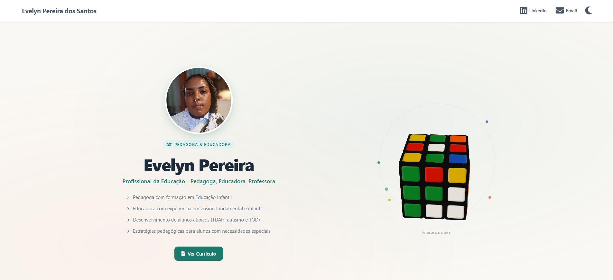
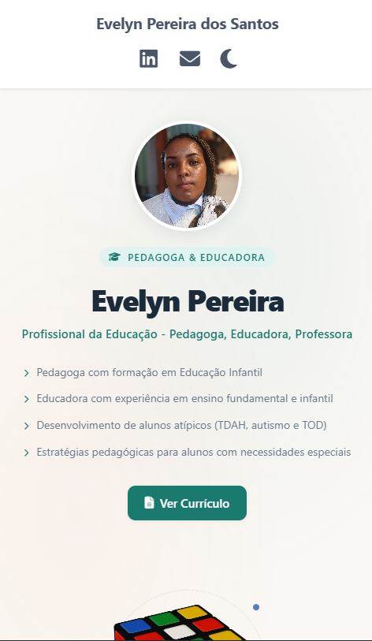

<div align="center">

<br />

# Personal Portfolio Website - Evelyn

### *Pedagogue & Educator*

<br />


<br />

> A handcrafted portfolio for a professional educator with warm pedagogical identity. Features a fully interactive 3D Rubik's Cube, fluid dark mode, CSS custom properties design system, and responsive-first layout.

<br />

</div>

---

## Table of Contents

- [Overview](#overview)
- [Screenshots](#screenshots)
- [Features](#features)
- [Tech Stack](#tech-stack)
- [Design System & UI Philosophy](#design-system--ui-philosophy)
- [Project Structure](#project-structure)
- [Installation & Local Development](#installation--local-development)
- [Performance & Optimization](#performance--optimization)
- [Credits & Attributions](#credits--attributions)
- [Author](#author)
- [License](#license)

---

## Overview

**evelyn-website** is a single-page portfolio built for Evelyn Pereira dos Santos, a pedagogue and educator specializing in early childhood development and inclusive education for students with ADHD, autism, and ODD.

The project was designed with two core intentions in mind:

**Professional credibility** — A clean, recruiter-ready digital presence that communicates Evelyn's expertise in special education and inclusive pedagogy.

The color palette and typographic system were chosen to feel **warm, approachable, and academically credible** — a balance that mirrors the dual nature of Evelyn's work: nurturing and rigorous in equal measure.

---

## Screenshots

<br />

<div align="center">

### Desktop



<br /><br />

### Mobile



</div>

<br />

---

## Features

### Interactive 3D Rubik's Cube
A fully interactive Rubik's Cube rendered entirely with CSS `perspective` and `rotateX/Y/Z` transforms — no Three.js, no WebGL, no canvas. Drag-to-rotate with mouse and touch, momentum inertia, idle auto-spin, and a scripted scramble animation on page load. The cube engine is based on the original work by **Dmytro Omelyan** (see [Credits](#credits--attributions)).

### Dark Mode
Seamless theme switching via a single `data-theme` attribute on `<html>`. The entire visual system — backgrounds, surfaces, text, shadows, cube colors, and gradients — reacts in one CSS variable cascade with smooth `0.3s ease` transitions.


### Motion Design
CSS `@keyframes` animations for the orbital ring (`ring-spin`), floating decorative dots (`float-dot`), and smooth JS-driven cube inertia. All animations respect natural physics — easing curves that feel considered, not procedural.

---

## Tech Stack

| Layer | Technology | Rationale |
|---|---|---|
| Structure | HTML5 | Semantic, accessible, future-proof markup |
| Styling | CSS3 + Custom Properties | Design token system without preprocessor overhead |
| Logic | Vanilla JavaScript (ES5+ IIFE) | Maximum compatibility, zero build step, full control |
| Icons | Font Awesome 6.5 | High-quality SVG icon library via CDN |
| 3D Rendering | CSS `perspective` + `transform-style: preserve-3d` | GPU-accelerated, no canvas or WebGL required |


---

## Project Structure

```
evelyn-website/
├── assets/
│   └── img/
│       └── evelyn.webp          # Optimized hero portrait (WebP format)
├── css/
│   ├── variables.css            # Design token system (light + dark themes)
│   └── styles.css               # Full layout, component, and responsive styles
├── js/
│   └── cube.js                  # Rubik's Cube engine (adapted) + dark mode toggle
├── index.html                   # Single entry point — full semantic markup
├── .gitignore                   # Standard Node/JS artifact exclusions
├── LICENSE                      # MIT License
└── README.md                    # This file
```

**Separation of concerns:**
- `variables.css` is purely declarative — no layout, only tokens. This allows theming to be changed independently of layout logic.
- `cube.js` is wrapped in a self-invoking IIFE to avoid global namespace pollution. The dark mode toggle is a second IIFE, keeping concerns isolated.
- All layout decisions live in `styles.css`, organized top-down by component: reset → nav → hero → cube → footer → responsive breakpoints.

---

## Credits & Attributions

### Rubik's Cube Engine

The 3D Rubik's Cube at the heart of this project is based on the original work by **Dmytro Omelyan**, published on CodePen:

> **"Rubik's cube in Javascript"** — Dmytro Omelyan  
> https://codepen.io/Omelyan/pen/BKmedK

The core geometry model (face adjacency function `mx()`, piece assembly, sticker swap logic) originates from that pen. This project adapted the engine to fit the portfolio's visual identity: integrating it with a CSS custom properties theming system, adding idle auto-rotation, touch support with inertia, a scripted scramble sequence, and embedding it within the page layout. All modifications are documented inline in `js/cube.js`.

Full credit and appreciation to Dmytro Omelyan for publishing this work openly.

---

## Author

<div align="center">

<br />

**Developed by Thiago da Silva**  
*Computer Engineering Student — São Paulo, Brasil*

<br />

[](https://github.com/dasilva-thiago)
[](https://www.linkedin.com/in/thiago-da-silva-876805269/)
[](mailto:thiagosilva785@gmail.com)

<br />

</div>

---

## License

This project is licensed under the **MIT License** — see the [LICENSE](LICENSE) file for details.

The Rubik's Cube engine is adapted from Dmytro Omelyan's original CodePen (https://codepen.io/Omelyan/pen/BKmedK). Please refer to CodePen's terms regarding reuse of published pens.

---

<div align="center">

<br />

*Developed by Thiago da Silva with care and respect for clean code.*

<br />

</div>